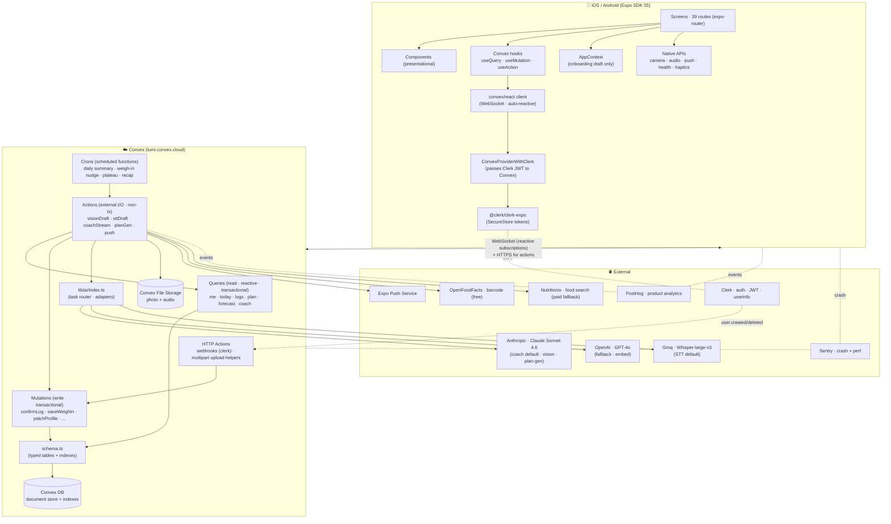
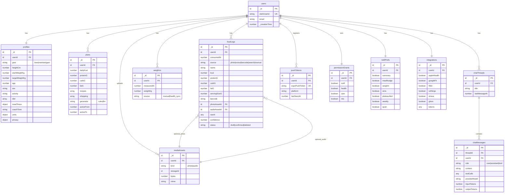
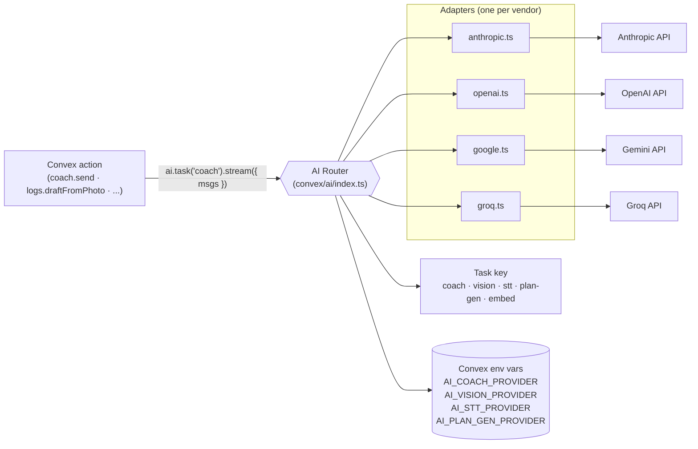
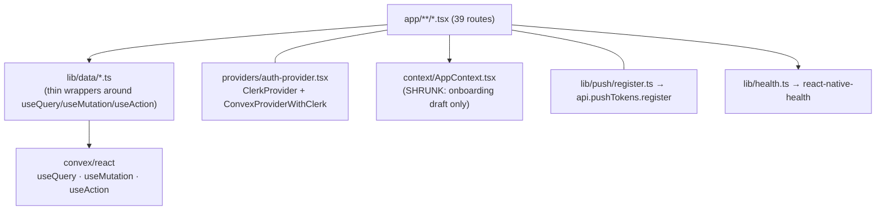

# Lumi — Full System Schema (Architecture + User Flows)

## Context

Lumi today: Expo SDK 55 RN app, 39 screens, all data faked or in `AppContext` + AsyncStorage. No backend. Coach scripted (3 prompts). Log/Confirm hardcoded. Forecast static. Plan = no real generator.

Goal: real product, real backend.

Locked decisions:
- **Multi-user from day 1** (auth + per-user data isolation even if user is solo today).
- **Backend: Convex.** Queries/mutations as typed TS functions, reactive client subscriptions, transactional writes, built-in scheduled functions, file storage, auth integration. No Vercel Functions, no Postgres, no Drizzle, no TanStack Query.
- **Auth: Clerk** (via Convex's Clerk integration — JWT verified by Convex, identity exposed in `ctx.auth.getUserIdentity()`).
- **AI provider abstraction** — pluggable per task (`coach`, `vision`, `stt`, `plan-gen`); Anthropic default, OpenAI/Groq as alternates.
- **Payments out of scope.** Paywall screen stays no-op.

This doc = the schema. Mermaid diagrams cover stack top-to-bottom and every user flow. All 39 screens accounted for in §10.

---

## 1. System architecture



Layer responsibilities:

| Layer | Owns |
|---|---|
| **Screens** | Render, navigate, per-screen UX state |
| **Convex hooks** | Server state read/write — `useQuery`/`useMutation`/`useAction` directly |
| **convex/react client** | WebSocket, reactive subscription mgmt, optimistic updates |
| **Clerk** | Sign-in/up, JWT, SecureStore cache; Convex receives JWT and verifies |
| **Convex queries** | Read functions, reactive, transactional reads, indexed |
| **Convex mutations** | Write functions, transactional, no external I/O |
| **Convex actions** | External I/O (LLM, push, OFF, Nutritionix); call queries+mutations internally |
| **Convex HTTP actions** | Inbound webhooks (Clerk), multipart helpers |
| **Convex crons** | Scheduled actions (daily summary, weigh-in nudge, plateau detect, weekly recap) |
| **Convex DB** | Document store w/ typed schema + indexes; per-row auth via `ctx.auth.getUserIdentity()` |
| **Convex Storage** | Photo + audio blobs; `ctx.storage.generateUploadUrl()` flow |
| **AI router** | Task-keyed provider selection; lives inside `convex/ai/`; called from actions only |

Reactivity: any client `useQuery` auto-subscribes via WebSocket; mutation invalidation is automatic from data dependencies. **No TanStack Query, no manual cache mgmt, no offline replay queue at app level** (Convex client already reconnects + replays mutations).

---

## 2. Data model (Convex schema)



Schema (`convex/schema.ts`) sketch:

```ts
import { defineSchema, defineTable } from 'convex/server';
import { v } from 'convex/values';

export default defineSchema({
  users: defineTable({
    clerkUserId: v.string(),
    email: v.string(),
    deletedAt: v.optional(v.number()),    // soft-delete; queries filter !deletedAt
  })
    .index('by_clerk', ['clerkUserId']),

  profiles: defineTable({
    userId: v.id('users'),
    goal: v.union(v.literal('lose'), v.literal('maintain'), v.literal('gain')),
    heightCm: v.number(),
    startWeightKg: v.number(),
    targetWeightKg: v.number(),
    age: v.number(),
    sex: v.optional(v.string()),
    activity: v.union(v.literal('sed'), v.literal('light'), v.literal('mod'), v.literal('active')),
    diet: v.array(v.string()),
    mealTimes: v.object({
      wake: v.string(), breakfast: v.string(), lunch: v.string(), dinner: v.string(), sleep: v.string(),
    }),
    coachTone: v.union(v.literal('Warm'), v.literal('Direct'), v.literal('Cheerleader'), v.literal('Stoic')),
    units: v.object({
      mass: v.string(), height: v.string(), energy: v.string(),
      volume: v.string(), firstDay: v.string(), lang: v.string(),
    }),
    privacy: v.object({ analytics: v.boolean(), share: v.boolean(), research: v.boolean() }),
    tz: v.string(),  // IANA tz, e.g. 'Europe/Madrid'; seeded from expo-localization at signup
  }).index('by_user', ['userId']),

  plans: defineTable({
    userId: v.id('users'),
    dailyKcal: v.number(),
    proteinG: v.number(),
    carbG: v.number(),
    fatG: v.number(),
    recipes: v.array(v.object({
      id: v.string(),               // stable client-side id
      day: v.number(),              // 0-6 from activeFrom
      slot: v.union(v.literal('breakfast'), v.literal('lunch'), v.literal('dinner'), v.literal('snack')),
      name: v.string(),
      kcal: v.number(),
      proteinG: v.number(),
      carbG: v.number(),
      fatG: v.number(),
      ingredients: v.array(v.object({ id: v.string(), name: v.string(), qty: v.string() })),
      method: v.array(v.string()),
      heroTone: v.optional(v.string()),  // for FoodPlate gradient
      isFavorite: v.optional(v.boolean()),
      doneAt: v.optional(v.number()),    // timestamp when user marked done
    })),
    shopping: v.array(v.object({
      id: v.string(),                  // stable id (hash of ingredient name)
      name: v.string(),
      qty: v.string(),                 // aggregated, human-readable
      recipeIds: v.array(v.string()),  // back-refs into recipes[].id
      checked: v.boolean(),
      checkedAt: v.optional(v.number()),
    })),
    generator: v.union(v.literal('rules'), v.literal('llm')),
    activeFrom: v.number(),
    activeTo: v.number(),
  }).index('by_user_active', ['userId', 'activeFrom']),

  foodLogs: defineTable({
    userId: v.id('users'),
    consumedAt: v.number(),
    source: v.union(v.literal('photo'), v.literal('voice'), v.literal('barcode'), v.literal('search'), v.literal('manual')),
    name: v.string(),
    kcal: v.number(),
    proteinG: v.number(),
    carbG: v.number(),
    fatG: v.number(),
    servingSizeG: v.optional(v.number()),
    barcode: v.optional(v.string()),
    photoAssetId: v.optional(v.id('mediaAssets')),
    audioAssetId: v.optional(v.id('mediaAssets')),
    rawAi: v.optional(v.any()),
    confidence: v.optional(v.number()),
    status: v.union(v.literal('draft'), v.literal('confirmed'), v.literal('deleted')),
    fromRecipeId: v.optional(v.string()),  // links log to plans.recipes[].id (US-42)
  })
    .index('by_user_consumedAt', ['userId', 'consumedAt'])
    .index('by_user_status', ['userId', 'status']),

  weighIns: defineTable({
    userId: v.id('users'),
    measuredAt: v.number(),
    weightKg: v.number(),
    source: v.union(v.literal('manual'), v.literal('health_sync')),
  }).index('by_user_measuredAt', ['userId', 'measuredAt']),

  chatThreads: defineTable({
    userId: v.id('users'),
    title: v.string(),
    lastMessageAt: v.number(),
  }).index('by_user_lastMessageAt', ['userId', 'lastMessageAt']),

  chatMessages: defineTable({
    threadId: v.id('chatThreads'),
    userId: v.id('users'),
    role: v.union(v.literal('user'), v.literal('assistant'), v.literal('tool')),
    content: v.string(),
    toolCalls: v.optional(v.any()),
    providerModel: v.optional(v.string()),
    inputTokens: v.optional(v.number()),
    outputTokens: v.optional(v.number()),
  }).index('by_thread', ['threadId']),

  pushTokens: defineTable({
    userId: v.id('users'),
    expoPushToken: v.string(),
    platform: v.union(v.literal('ios'), v.literal('android')),
    lastSeenAt: v.number(),
  })
    .index('by_user', ['userId'])
    .index('by_token', ['expoPushToken']),

  permissionGrants: defineTable({
    userId: v.id('users'),
    notif: v.boolean(), health: v.boolean(), cam: v.boolean(), mic: v.boolean(),
  }).index('by_user', ['userId']),

  notifPrefs: defineTable({
    userId: v.id('users'),
    summary: v.boolean(), mealNudge: v.boolean(), weighIn: v.boolean(),
    wins: v.boolean(), plateauAlert: v.boolean(), weekly: v.boolean(), quiet: v.boolean(),
  }).index('by_user', ['userId']),

  integrations: defineTable({
    userId: v.id('users'),
    appleHealth: v.boolean(), googleFit: v.boolean(), fitbit: v.boolean(),
    withings: v.boolean(), strava: v.boolean(), glovo: v.boolean(),
    tokens: v.optional(v.any()),
  }).index('by_user', ['userId']),

  mediaAssets: defineTable({
    userId: v.id('users'),
    kind: v.union(v.literal('photo'), v.literal('audio')),
    storageId: v.id('_storage'),
    bytes: v.number(),
    mime: v.string(),
  }).index('by_user', ['userId']),

  // Cron idempotency
  cronRuns: defineTable({
    jobName: v.string(),
    scopeKey: v.string(),       // e.g. `${userId}:${dateLocal}` or `${dateLocal}`
    ranAt: v.number(),
  }).index('by_job_scope', ['jobName', 'scopeKey']),

  // Pre-computed forecast curves (warmed nightly)
  forecastSnapshots: defineTable({
    userId: v.id('users'),
    range: v.union(v.literal('7d'), v.literal('30d')),
    generatedAt: v.number(),
    payload: v.any(),
  }).index('by_user_range', ['userId', 'range']),

  // Non-chat AI call telemetry (chat lives in chatMessages)
  aiCalls: defineTable({
    userId: v.id('users'),
    task: v.string(),           // 'vision' | 'stt' | 'plan-gen' | 'embed'
    providerModel: v.string(),
    inputTokens: v.number(),
    outputTokens: v.number(),
    ms: v.number(),
    ok: v.boolean(),
    errorCode: v.optional(v.string()),
  }).index('by_user', ['userId']),
});
```

**Auth-based isolation** (every fn): pull `ctx.auth.getUserIdentity()`, look up `users` row by `clerkUserId`, derive `userId`, scope every query/mutation by it. No SQL RLS — function body owns enforcement. Centralize in `convex/lib/auth.ts`:

```ts
export async function requireUser(ctx) {
  const ident = await ctx.auth.getUserIdentity();
  if (!ident) throw new Error('Unauthenticated');
  const user = await ctx.db.query('users')
    .withIndex('by_clerk', q => q.eq('clerkUserId', ident.subject)).unique();
  if (!user) throw new Error('User not synced');
  return user;
}
```

`AppState` → tables map (every field accounted):

| AppState field | Lands in |
|---|---|
| `weight`, `height`, `age`, `target` | `profiles` |
| `goal`, `activity`, `diet` | `profiles` |
| `mealTimes` | `profiles.mealTimes` |
| `permissions` | `permissionGrants` |
| `weighInDue`, `lastWeight` | derived from `weighIns` query |
| `coachTone` | `profiles.coachTone` |
| `units` | `profiles.units` |
| `integrations` | `integrations` |
| `privacy` | `profiles.privacy` |
| `subscription` | **out of scope** — drop from client state |
| `notifPrefs` | `notifPrefs` |

---

## 3. AI provider abstraction



Use Vercel AI SDK as the cross-provider abstraction. **Note**: Convex functions default to V8 isolates, which lack Node-only APIs needed by AI SDK. Every file that imports `convex/ai/*` must declare `"use node";` at the top — that includes `convex/coach.actions.ts`, `convex/logs.ts` (draft actions), `convex/plan.ts` (generate), `convex/profileSetup.ts`, and any cron handler that calls Coach. If a file mixes V8 mutations + Node actions, **split**: e.g. `convex/coach.queries.ts` (V8) + `convex/coach.actions.ts` (Node).

```ts
// convex/ai/index.ts
"use node";
import { generateText, streamText } from 'ai';
import { anthropic } from '@ai-sdk/anthropic';
import { openai } from '@ai-sdk/openai';
import { groq } from '@ai-sdk/groq';

export type Task = 'coach' | 'vision' | 'stt' | 'embed' | 'plan-gen';

const PROVIDERS = { anthropic, openai, groq } as const;
const DEFAULTS: Record<Task, { provider: keyof typeof PROVIDERS; model: string }> = {
  coach:      { provider: 'anthropic', model: 'claude-sonnet-4-6' },
  vision:     { provider: 'anthropic', model: 'claude-sonnet-4-6' },
  stt:        { provider: 'groq',      model: 'whisper-large-v3' },
  embed:      { provider: 'openai',    model: 'text-embedding-3-small' },
  'plan-gen': { provider: 'anthropic', model: 'claude-sonnet-4-6' },
};

function pick(t: Task) {
  const env = process.env[`AI_${t.toUpperCase().replace('-', '_')}_PROVIDER`] as keyof typeof PROVIDERS | undefined;
  return env ? { provider: env, model: DEFAULTS[t].model } : DEFAULTS[t];
}

export const ai = {
  task(t: Task) {
    const { provider, model } = pick(t);
    const m = PROVIDERS[provider](model);
    return {
      generate: (opts: any) => generateText({ model: m, ...opts }),
      stream:   (opts: any) => streamText  ({ model: m, ...opts }),
    };
  },
};
```

Default routing (env-overridable):

| Task | Default | Why | Fallback |
|---|---|---|---|
| `coach` | Anthropic Claude Sonnet 4.6 | Long context + prompt caching for profile/logs | OpenAI gpt-4o |
| `vision` | Anthropic Claude Sonnet 4.6 | One vendor for chat+vision = simpler context | OpenAI gpt-4o |
| `stt` | Groq whisper-large-v3 | <1s typical, cheapest | OpenAI whisper-1 |
| `embed` | OpenAI text-embedding-3-small | If we add semantic search later | — |
| `plan-gen` | Anthropic Claude Sonnet 4.6 | Recipe variety w/ structured output | OpenAI gpt-4o |

Every call:
- adds `metadata: { userId, task, requestId }` for observability
- enables prompt caching for `system` + `profile` blocks (Anthropic)
- writes `providerModel`, `inputTokens`, `outputTokens` to `chatMessages` (or `aiCalls` table for non-chat)

---

## 4. Function surface (Convex)

Naming: `<table>.<verb>` where possible. Files in `convex/`. Auto-generated client API at `convex/_generated/api.ts`.

### Queries (reactive read)

```
api.me.get                        → { user, profile, plan, integrations, permissions, notifPrefs }
api.today.get                     → { kcalLeft, kcalTotal, macros, ringPct, mascotMood, streakDays, meals[] }
api.logs.byDate({ date })         → confirmed FoodLog[]
api.plan.active                   → Plan | null
api.plan.recipe({ id })           → Recipe
api.coach.threads                 → ChatThread[]
api.coach.messages({ threadId })  → ChatMessage[]
api.forecast.get({ range })       → { points[], curve }
api.weighIns.recent({ days })     → WeighIn[]
```

### Mutations (transactional write)

```
api.profile.patch({ partial })
api.permissionGrants.set({ key, value })
api.notifPrefs.set({ partial })
api.integrations.toggle({ vendor, enabled })
api.logs.confirm({ draft, edits })          // promotes draft → confirmed
api.logs.delete({ id })
api.weighIns.create({ weightKg })
api.coach.threadCreate                       // returns threadId
api.pushTokens.register({ token, platform })
api.pushTokens.unregister({ token })         // call from Clerk sign-out hook
api.user.restart                             // wipes user rows + iterates mediaAssets
                                              // and ctx.storage.delete each blob
api.user.requestDelete                       // user-initiated account delete:
                                              // a) calls Clerk SDK useUser().delete() from client first
                                              // b) Clerk webhook user.deleted fires →
                                              //    internal.user.softDelete cleans server side
                                              // (this mutation is the fallback for "I changed my mind"
                                              //  before Clerk delete propagates; sets users.deletedAt)
api.upload.generate                          // returns one-shot POST url for blob upload
api.plan.addToShopping({ recipeId })         // copies recipe ingredients into plan.shopping
                                              // (de-dupes by name, aggregates qty, appends recipeId)
api.plan.toggleShoppingItem({ itemId })      // flips checked + sets checkedAt
api.plan.markRecipeDone({ recipeId, doneAt })  // sets recipes[].doneAt
api.plan.toggleRecipeFavorite({ recipeId })  // flips recipes[].isFavorite
```

### Actions — public (client-callable)

```
api.profileSetup.commit({ draft })           // first profile creation; calls plan.generate
api.plan.generate                            // LLM-pick recipes via ai.task('plan-gen')
api.logs.draftFromPhoto({ storageId })       // vision → draft
api.logs.draftFromVoice({ storageId })       // STT + parse → draft
api.logs.draftFromBarcode({ ean })           // OFF + Nutritionix fallback → draft
api.logs.draftFromSearch({ q })              // Nutritionix → results[]
api.coach.send({ threadId, content })        // appends chunks via internal mutations;
                                              // client subscribes via useQuery(messages)
```

### Internal functions (server-only — not callable from client)

```
internal.push.send({ userId, payload })       // called by crons
internal.coach.appendChunk({ msgId, delta })  // called by coach.send streaming loop
internal.coach.cancel({ msgId })              // sets cancellations[msgId]=true; loop checks each chunk (US-55)
internal.user.upsert                          // called by Clerk webhook user.created
internal.user.softDelete                      // called by Clerk webhook user.deleted; sets deletedAt + iterates
                                               //   all owned tables + ctx.storage.delete each mediaAsset
internal.crons.dailySummary
internal.crons.mealNudge
internal.crons.weighInReminder
internal.crons.weeklyRecap
internal.crons.plateauDetect
internal.crons.forecastWarm
internal.crons.draftCleanup
```

Convex distinguishes `query`/`mutation`/`action` (public) from `internalQuery`/`internalMutation`/`internalAction` (server-only). Always make cron-only and action-only-callable functions internal.

### HTTP Actions

```
POST /webhooks/clerk      // user.created/deleted → mutation.user.upsert / .softDelete
GET  /storage/upload-url  // optional: returns generateUploadUrl()
```

### Crons (`convex/crons.ts`)

```ts
crons.cron('daily-summary',     '0 8  * * *', internal.crons.dailySummary);
crons.cron('weigh-in-reminder', '0 9  * * *', internal.crons.weighInReminder);
crons.cron('weekly-recap',      '0 9  * * 0', internal.crons.weeklyRecap);
crons.cron('plateau-detect',    '0 10 * * *', internal.crons.plateauDetect);
crons.interval('meal-nudge',    { minutes: 30 }, internal.crons.mealNudge);
crons.cron('forecast-warm',     '0 2 * * *', internal.crons.forecastWarm);
crons.cron('draft-cleanup',     '0 3 * * *', internal.crons.draftCleanup);
```

Conventions:
- Every fn first calls `requireUser(ctx)`.
- Mutations stay pure (no `fetch`, no LLM); actions wrap mutations for that.
- Actions return JSON-serializable values; for streams (`coach.send`) write incremental chunks via internal mutation, client `useQuery` re-renders on each.
- Errors throw — Convex serializes message to client.

---

## 5. Client architecture (Expo)



Rules:
- Screens never `fetch`. Use `useQuery(api.x.y, args)` / `useMutation(api.x.y)` / `useAction(api.x.y)` directly, or via thin `lib/data/` wrappers.
- Server state → Convex hooks (auto-reactive).
- Onboarding draft → AppContext (until `compute` screen commits via `api.profileSetup.commit`).
- UI state → `useState`.
- Optimistic updates → chain `.withOptimisticUpdate(...)` on the mutation hook:
  ```ts
  const confirmLog = useMutation(api.logs.confirm).withOptimisticUpdate((store, args) => {
    const today = store.getQuery(api.today.get, {});
    if (!today) return;
    store.setQuery(api.today.get, {}, { ...today, meals: [...today.meals, args.draft] });
  });
  ```
- Offline → Convex client buffers mutations and replays on reconnect; subscriptions resume automatically.

Provider mount (in `app/_layout.tsx`):

```tsx
<ClerkProvider tokenCache={secureStoreCache} publishableKey={env.CLERK_PUB}>
  <ConvexProviderWithClerk client={convex} useAuth={useAuth}>
    <KeyboardProvider>
      <AppProvider>
        <Gate>...stack...</Gate>
      </AppProvider>
    </KeyboardProvider>
  </ConvexProviderWithClerk>
</ClerkProvider>
```

---

## 6. User-flow diagrams (every flow)

### 6a. Boot

```mermaid
flowchart TD
    Cold[Cold launch] --> Splash[expo-splash-screen]
    Splash --> Fonts[Load Fraunces + DM Sans]
    Fonts --> Hydrate[Hydrate AppContext from AsyncStorage]
    Hydrate --> Auth{Clerk session?}
    Auth -- no --> Welcome[/onboarding/welcome/]
    Auth -- yes --> Me["useQuery(api.me.get)"]
    Me -- profile null --> Welcome
    Me -- profile set --> Today[/(tabs)/today/]
    Me -- 401 --> SignIn[Clerk modal]
    SignIn --> Me
```

### 6b. Onboarding (10 screens)

```mermaid
flowchart LR
    W[welcome] --> SignUp{New user?}
    SignUp -- yes --> Clerk[Clerk sign-up]
    SignUp -- no --> Clerk2[Clerk sign-in]
    Clerk -. webhook user.created .-> SyncUser[http.webhooks.clerk → user.upsert]
    Clerk --> G[goal]
    Clerk2 --> Today2[/today/]
    G --> B[body]
    B --> AL[activity-level]
    AL --> D[diet]
    D --> S[schedule]
    S --> C[compute · animation]
    C -->|on enter: useAction api.profileSetup.commit| C
    C --> PR[plan-reveal]
    PR --> P[permissions]
    P -->|notif| Notif[expo-notifications request]
    P -->|health| Health[react-native-health request]
    P -->|cam| Cam[expo-camera request]
    P -->|mic| Mic[expo-audio request]
    P -.toggle.-> SetGrant[api.permissionGrants.set]
    P --> PW[paywall · NO-OP]
    PW --> Today3[/today/]
```

`compute` is the persistence boundary: onboarding draft (AppContext) commits via `api.profileSetup.commit` → action creates profile + initial plan + default notifPrefs/integrations/permissionGrants rows.

### 6c. Today (dashboard)

```mermaid
flowchart TD
    Today[/(tabs)/today/] -->|on focus| Q1["useQuery(api.today.get)"]
    Q1 --> Render[ring · macros · streak · meals · mascot]
    Today -->|tap FAB| Choose[/log/choose/]
    Today -->|tap meal slot| Confirm[/log/confirm pre-filled/]
    Today -->|tap weigh-in card| WI[/(tabs)/stats/weigh-in/]
    Today -->|tap mascot| Coach[/(tabs)/coach/]
```

Reactive: when a `foodLogs` row is inserted, the WebSocket pushes the new value, screen re-renders. No invalidation code.

### 6d. Log flow (5 sources → confirm → save)

```mermaid
flowchart TD
    Choose[/log/choose] -->|photo| Photo[/log/photo/]
    Choose -->|voice| Voice[/log/voice/]
    Choose -->|barcode| Bar[/log/barcode/]
    Choose -->|search| Srch[/log/search/]

    Photo --> CamPerm{cam granted?}
    CamPerm -- no --> CamFallback[Open settings]
    CamPerm -- yes --> Capture[CameraView capture]
    Capture --> UploadURL["mutation api.upload.generate"]
    UploadURL --> UpBlob["POST blob → Convex Storage<br/>returns { storageId }"]
    UpBlob --> ActVision["useAction(api.logs.draftFromPhoto)"]
    ActVision -->|ai.task('vision')| Draft1[draft FoodLog inserted]

    Voice --> MicPerm{mic granted?}
    MicPerm -- yes --> Rec[expo-audio record]
    Rec --> UpBlob2[upload → storageId]
    UpBlob2 --> ActVoice["useAction(api.logs.draftFromVoice)"]
    ActVoice -->|ai.task('stt') → ai.task('coach') parse| Draft2[draft]

    Bar --> CamPerm2{cam granted?}
    CamPerm2 -- yes --> Scan[CameraView barcodeScannerSettings]
    Scan --> ActBar["useAction(api.logs.draftFromBarcode)"]
    ActBar -->|OFF → Nutritionix fallback| Draft3[draft]

    Srch --> SrchInput[debounced TextInput]
    SrchInput --> ActSrch["useAction(api.logs.draftFromSearch)"]
    ActSrch --> Results[results list]
    Results -->|tap row| Draft4[create draft from row]

    Draft1 --> Confirm[/log/confirm draftId/]
    Draft2 --> Confirm
    Draft3 --> Confirm
    Draft4 --> Confirm

    Confirm -->|edit kcal/macros/serving| Confirm
    Confirm -->|Add to today| Mut["useMutation(api.logs.confirm)"]
    Mut -->|optimisticUpdate inserts confirmed row in cache| Today2[/(tabs)/today/]
    Mut -.offline.- ConvexBuf[(Convex client buffer)]
    ConvexBuf -->|reconnect| Mut
```

Drafts stored as rows w/ `status='draft'`. Confirm flips to `'confirmed'`. Cleanup cron evicts drafts older than 24h.

Upload pattern (client side):
```ts
const url = await convex.mutation(api.upload.generate);
const res = await fetch(url, { method: 'POST', headers: { 'Content-Type': mime }, body: blob });
const { storageId } = await res.json();
const draft = await convex.action(api.logs.draftFromPhoto, { storageId });
```

### 6e. Coach (chat w/ tool calls)

```mermaid
flowchart TD
    CoachScreen[/(tabs)/coach/] -->|on focus| Threads["useQuery(api.coach.threads)"]
    Threads --> Latest[latest or new]
    Latest --> Msgs["useQuery(api.coach.messages, threadId)"]
    Msgs --> Render[FlatList bubbles]
    CoachScreen -->|user types| Send["useAction(api.coach.send)"]
    Send -->|action: insert user msg → stream Claude| StreamBlock[streaming response]
    StreamBlock -->|tool: getTodayLogs| ToolImpl[runs query.logs.byDate]
    StreamBlock -->|tool: suggestSwap| ToolImpl2[runs query.plan.active]
    ToolImpl --> StreamBlock
    ToolImpl2 --> StreamBlock
    StreamBlock -->|deltas appended via internal mutation| Reactive[useQuery messages re-renders]
    Reactive --> Render
```

System prompt (cached): `coachTone` + profile + active plan. Per-turn input includes the **last 20 messages** of thread tail. Token budget: ≤ 8k input tokens to stay within prompt-cache hit window. If a tool call demands earlier history, fetch on demand.

Streaming pattern: action writes assistant message row first, calls `internal.coach.appendChunk({ msgId, delta })` mutation on each `streamText` chunk; `useQuery(api.coach.messages)` re-renders incrementally as the row's `content` grows.

### 6f. Plan / Recipe / Shopping

```mermaid
flowchart TD
    Plan[/(tabs)/plan/] -->|on focus| GetPlan["useQuery(api.plan.active)"]
    GetPlan --> Cards[meal cards]
    Plan -->|tap recipe| Recipe[/plan/recipe?id=/]
    Recipe --> GetRecipe["useQuery(api.plan.recipe, id)"]
    Plan -->|tap shopping| Shop[/plan/shopping/]
    Shop --> ShopData[plan.shopping aggregated]
    Recipe -->|swap| CoachAction[coach msg w/ action: swap]
```

### 6g. Stats hub

```mermaid
flowchart TD
    Stats[/(tabs)/stats/] -->|on focus| Forecast["useQuery(api.forecast.get, '7d')"]
    Forecast --> Curve[SVG forecast chart]
    Stats --> WI[weigh-in card · weighInDue derived]
    WI --> WIScreen[/stats/weigh-in/]
    WIScreen --> WIInput[TextInput numeric]
    WIInput --> WISave["useMutation(api.weighIns.create)"]
    WISave --> WIResult[/stats/weigh-in-result/]
    WIResult -->|delta hits milestone| Mile[/stats/milestone/]
    WIResult -->|no change 7d| Plat[/stats/plateau/]
    WIResult -->|over kcal 3d| Bad[/stats/bad-day/]
    Stats --> Activity[/stats/activity/]
    Activity --> ActData[react-native-health + api.me.get]
    Stats --> MGall[/stats/mascot-gallery/]
    MGall --> Static[no backend]
```

### 6h. Profile / settings (11 screens)

```mermaid
flowchart TD
    Me[/(tabs)/me/] -->|on focus| Me1["useQuery(api.me.get)"]
    Me --> Edit[/me/edit/]
    Me --> Settings[/me/settings/]
    Settings --> Tone[/me/coach-tone/]
    Settings --> Units[/me/units/]
    Settings --> Integ[/me/integrations/]
    Settings --> Priv[/me/privacy/]
    Settings --> Sub[/me/subscription/ · NO-OP]
    Settings --> Notif[/me/notifications/]
    Settings --> Help[/me/help/]
    Edit -->|save| M1["useMutation(api.profile.patch)"]
    Tone -->|save| M2["useMutation(api.profile.patch, { coachTone })"]
    Units -->|save| M3["useMutation(api.profile.patch, { units })"]
    Integ -->|toggle| M4["useMutation(api.integrations.toggle)"]
    Priv -->|save| M5["useMutation(api.profile.patch, { privacy })"]
    Notif -->|save| M6["useMutation(api.notifPrefs.set)"]
```

### 6i. Push & background jobs

```mermaid
flowchart LR
    Cron1[Cron 08:00] --> Job1[dailySummary action]
    Cron2[interval 30m] --> Job2[mealNudge action]
    Cron3[Cron 09:00] --> Job3[weighInReminder action]
    Cron4[Cron Sun 09:00] --> Job4[weeklyRecap action]
    Cron5[Cron 10:00] --> Job5[plateauDetect action]
    Job1 & Job2 & Job3 & Job4 & Job5 --> Filter[Check notifPrefs]
    Filter --> Push["api.push.send (action)"]
    Push --> ExpoPush[Expo Push Service]
    ExpoPush --> Phone[Device notification]
    Phone -->|tap| Deep[Deep link]
    Deep --> Today[/(tabs)/today/] & WI[/(tabs)/stats/weigh-in/]
```

---

## 7. Repo layout

Single repo, no monorepo split (Convex sits next to Expo app):

```
lumi/
├─ app/                  ← Expo screens (unchanged)
├─ components/
├─ context/
├─ lib/
│  ├─ data/             ← optional thin wrappers around Convex hooks
│  ├─ push/
│  ├─ health.ts
│  └─ ...
├─ convex/              ← NEW: Convex backend
│  ├─ schema.ts
│  ├─ auth.config.ts    ← Clerk JWKS config
│  ├─ lib/
│  │  └─ auth.ts        ← requireUser helper
│  ├─ users.ts          ← upsert from webhook, get-by-clerk
│  ├─ me.ts             ← api.me.get
│  ├─ profiles.ts       ← profile.patch
│  ├─ profileSetup.ts   ← action: commit + plan.generate
│  ├─ today.ts
│  ├─ logs.ts           ← byDate, confirm, delete, draft actions
│  ├─ plan.ts           ← active, recipe, generate
│  ├─ forecast.ts
│  ├─ weighIns.ts
│  ├─ coach.ts          ← threads, messages, send (streaming action)
│  ├─ pushTokens.ts
│  ├─ permissionGrants.ts
│  ├─ notifPrefs.ts
│  ├─ integrations.ts
│  ├─ ai/
│  │  ├─ index.ts       ← provider router
│  │  ├─ anthropic.ts
│  │  ├─ openai.ts
│  │  └─ groq.ts
│  ├─ crons.ts
│  ├─ http.ts           ← webhooks/clerk
│  └─ _generated/       ← Convex-generated types & API
├─ legacy-web/          ← unchanged
├─ docs/
│  ├─ ARCHITECTURE.md   ← this doc
│  ├─ OPERATIONS.md
│  ├─ PERF.md
│  └─ VISUAL-DIFF.md
├─ convex.json
├─ AGENTS.md            ← managed by Convex if aiFiles enabled
├─ CLAUDE.md            ← managed by Convex if aiFiles enabled
└─ package.json
```

`convex.json` (per user preference — disabled, all 3 agents targeted when re-enabled):

```json
{
  "aiFiles": {
    "enabled": false,
    "skills": {
      "agents": ["claude-code", "codex", "cursor"]
    }
  }
}
```

Re-enable later w/ `npx convex ai-files enable` if you want auto-managed `AGENTS.md` / `CLAUDE.md` sections.

Convex agent skills install (separate from `aiFiles`):

```
npx skills add get-convex/agent-skills
```

Adds Convex-specific skills (auth setup, schema design, migrations) consumable by Claude Code.

---

## 8. External services & secrets

| Service | Purpose | Where the secret lives |
|---|---|---|
| Convex | Backend platform | `CONVEX_DEPLOYMENT` (in `.env.local`), `EXPO_PUBLIC_CONVEX_URL` |
| Clerk | Auth | `CLERK_JWT_ISSUER_DOMAIN` in Convex env (referenced by `convex/auth.config.ts`); `EXPO_PUBLIC_CLERK_PUBLISHABLE_KEY` on client; `CLERK_WEBHOOK_SECRET` in Convex env. **Setup gotcha**: Clerk dashboard → JWT Templates → New → name MUST be exactly `convex` (matches `applicationID: 'convex'` in auth.config.ts). |
| Anthropic | LLM | Convex env: `ANTHROPIC_API_KEY` |
| OpenAI | LLM fallback | Convex env: `OPENAI_API_KEY` |
| Groq | STT | Convex env: `GROQ_API_KEY` |
| Nutritionix | Food DB | Convex env: `NUTRITIONIX_APP_ID`, `NUTRITIONIX_API_KEY` |
| OpenFoodFacts | Free barcode | (no key) |
| Expo Push | Push | Convex env: `EXPO_ACCESS_TOKEN` |
| Sentry | Crash | `SENTRY_DSN` (mobile) + Convex env |
| PostHog | Analytics | `EXPO_PUBLIC_POSTHOG_KEY` (mobile) + Convex env |

AI provider env (Convex):
```
AI_COACH_PROVIDER=anthropic
AI_VISION_PROVIDER=anthropic
AI_STT_PROVIDER=groq
AI_PLAN_GEN_PROVIDER=anthropic
```

Set per Convex deployment (dev / prod) for safe experimentation: `npx convex env set KEY value`.

---

## 9. Background jobs (Convex crons)

| Job | Schedule | Action |
|---|---|---|
| `dailySummary` | `0 * * * *` (hourly fan-out) | For each user where local hour == 8 AND `notifPrefs.summary` → push w/ yesterday's kcal vs target |
| `mealNudge` | every 30 min | For each user, check current time vs `mealTimes` in user-tz; if ±90min and no log → push |
| `weighInReminder` | `0 * * * *` (hourly fan-out) | For each user where local hour == 9 AND `last weigh-in > 7d` AND `notifPrefs.weighIn` → push |
| `weeklyRecap` | `0 * * * 0` | Sunday hourly; for each user where local hour == 9 → aggregate week, generate via `ai.task('coach')`, push deep-link |
| `plateauDetect` | `0 10 * * *` | UTC ok (lower urgency); linear regression on last 14d weights; flat slope → push to `/stats/plateau` |
| `forecastWarm` | `0 2 * * *` | Recompute forecast snapshots; written to `forecastSnapshots` for fast read |
| `draftCleanup` | `0 3 * * *` | Delete `foodLogs` rows w/ `status='draft'` older than 24h |

**Timezone handling**: Convex crons run in UTC. For per-user-tz delivery (dailySummary, weighInReminder, weeklyRecap), schedule hourly and inside the action filter users by `Date#toLocaleString(undefined, { timeZone: profile.tz, hour: 'numeric', hour12: false })` against the target hour. Idempotency via `cronRuns(jobName, "${userId}:${userLocalDate}")`.

**Quiet hours (US-82)**: every cron fan-out — before calling `internal.push.send` — checks `notifPrefs.quiet === true && (localHour >= 22 || localHour < 7)` and skips. Implement once in a shared `shouldDeliver(userId, kind)` helper called by all cron actions.

---

## 10. Screen coverage matrix (all 39)

| # | Route | Reads (Convex) | Writes (Convex) | Notes |
|---|---|---|---|---|
| 1 | `/` | `api.me.get` | — | redirect |
| 2 | `/onboarding/welcome` | — | — | static |
| 3 | `/onboarding/goal` | AppContext draft | `AppContext.goal` | local |
| 4 | `/onboarding/body` | draft | `weight,height,age,target` | local |
| 5 | `/onboarding/activity-level` | draft | `activity` | local |
| 6 | `/onboarding/diet` | draft | `diet[]` | local |
| 7 | `/onboarding/schedule` | draft | `mealTimes` | local |
| 8 | `/onboarding/compute` | draft | — | `useAction(api.profileSetup.commit)` then `plan.generate` |
| 9 | `/onboarding/plan-reveal` | `api.plan.active` | — | |
| 10 | `/onboarding/permissions` | `api.me.get` | `api.permissionGrants.set` per toggle | + native prompts |
| 11 | `/onboarding/paywall` | — | — | NO-OP |
| 12 | `/(tabs)/today` | `api.today.get` | — | reactive |
| 13 | `/(tabs)/plan` | `api.plan.active` | — | |
| 14 | `/(tabs)/plan/recipe` | `api.plan.recipe` | — | |
| 15 | `/(tabs)/plan/shopping` | `api.plan.active.shopping` | — | sub-field |
| 16 | `/(tabs)/coach` | `api.coach.threads`, `api.coach.messages` | `api.coach.send` (action) | streaming |
| 17 | `/(tabs)/stats` | `api.forecast.get` | — | |
| 18 | `/(tabs)/stats/activity` | `api.me.get` + `react-native-health` (iOS) | — | Android health = out of scope (Health Connect not yet Expo-wrapped) |
| 19 | `/(tabs)/stats/weigh-in` | `api.weighIns.recent` | `api.weighIns.create` | |
| 20 | `/(tabs)/stats/weigh-in-result` | `api.weighIns.recent(2)` | — | derived delta |
| 21 | `/(tabs)/stats/milestone` | `api.weighIns.recent` | — | derived |
| 22 | `/(tabs)/stats/plateau` | `api.weighIns.recent(14)` | — | derived |
| 23 | `/(tabs)/stats/bad-day` | `api.logs.byDate` × N | — | derived |
| 24 | `/(tabs)/stats/mascot-gallery` | — | — | UI only |
| 25 | `/(tabs)/me` | `api.me.get` | — | |
| 26 | `/(tabs)/me/edit` | `api.me.get` | `api.profile.patch` | |
| 27 | `/(tabs)/me/settings` | — | — | nav hub |
| 28 | `/(tabs)/me/coach-tone` | `api.me.get` | `api.profile.patch` | |
| 29 | `/(tabs)/me/units` | `api.me.get` | `api.profile.patch` | |
| 30 | `/(tabs)/me/integrations` | `api.me.get` | `api.integrations.toggle` | |
| 31 | `/(tabs)/me/privacy` | `api.me.get` | `api.profile.patch` | |
| 32 | `/(tabs)/me/subscription` | — | — | NO-OP |
| 33 | `/(tabs)/me/notifications` | `api.me.get` | `api.notifPrefs.set` | |
| 34 | `/(tabs)/me/help` | — | — | static |
| 35 | `/log/choose` | — | — | nav hub |
| 36 | `/log/photo` | cam perm | `api.logs.draftFromPhoto` (action) | |
| 37 | `/log/voice` | mic perm | `api.logs.draftFromVoice` (action) | |
| 38 | `/log/barcode` | cam perm | `api.logs.draftFromBarcode` (action) | |
| 39 | `/log/search` | — | `api.logs.draftFromSearch` (action) | |
| 40 | `/log/confirm` | draft from params | `api.logs.confirm` | |

(40 rows; `/` is a redirect → 39 user-facing.)

---

## 11. Critical files to create / modify

**Minimum versions (pin in package.json):**
- `convex` ≥ 1.24 (best React 19 support, JSON streaming)
- `@clerk/clerk-expo` ≥ 2.18 (Expo SDK 55 + React 19)
- `@react-native-async-storage/async-storage` ≥ 2.1 ✓ (already)
- `@convex-dev/rate-limiter` (Convex Component for rate limiting)
- `react-native-health` (iOS HealthKit; iOS-only)

**New (Convex backend):**
- `convex/schema.ts` — full schema (§2)
- `convex/auth.config.ts` — Clerk JWKS issuer
- `convex/lib/auth.ts` — `requireUser()` helper
- `convex/users.ts` — upsert from webhook, get-by-clerk
- `convex/me.ts` — `api.me.get`
- `convex/profiles.ts` — `profile.patch`
- `convex/profileSetup.ts` — commit action *(`"use node"`)* — creates profile + plan + default rows
- `convex/today.ts` — today snapshot query
- `convex/logs.queries.ts` — `byDate`, `confirm`, `delete` (V8)
- `convex/logs.actions.ts` — draft actions *(`"use node"`)*
- `convex/plan.queries.ts` — `active`, `recipe` (V8)
- `convex/plan.actions.ts` — `generate` action *(`"use node"`)*
- `convex/forecast.ts` — projection (V8 query) + warming action *(`"use node"`)*
- `convex/weighIns.ts`
- `convex/coach.queries.ts` — threads, messages (V8)
- `convex/coach.actions.ts` — `send` streaming action *(`"use node"`)*
- `convex/upload.ts` — `api.upload.generate` mutation (returns `ctx.storage.generateUploadUrl()`)
- `convex/pushTokens.ts`, `permissionGrants.ts`, `notifPrefs.ts`, `integrations.ts`
- `convex/ai/{index,anthropic,openai,groq}.ts` *(`"use node"`)*
- `convex/rateLimit.ts` — wraps `@convex-dev/rate-limiter`; limits Coach 30/min, vision 10/min, plan-gen 5/hr
- `convex/crons.ts`
- `convex/http.ts` — Clerk webhook handler
- `convex.json` — AI files config (see §7)

**New (mobile):**
- `lib/data/*.ts` (optional thin wrappers around Convex hooks)
- `lib/push/register.ts` — getExpoPushTokenAsync → `api.pushTokens.register`; on Clerk sign-out, call `api.pushTokens.unregister`
- `lib/locale.ts` — wraps `expo-localization`: `Localization.getCalendars()[0].timeZone` to seed `profiles.tz` at signup; date/time formatters
- `lib/health.ts` — wraps `react-native-health` for Activity screen (iOS only)
- `providers/auth-provider.tsx` — ClerkProvider + ConvexProviderWithClerk

**Modify (mobile):**
- `app/_layout.tsx` — wrap providers + push handler
- `context/AppContext.tsx` — strip server-state fields, keep onboarding draft only (see §2 mapping)
- `app/index.tsx` — gate on `useQuery(api.me.get)`
- `app/onboarding/compute.tsx` — call `api.profileSetup.commit`
- `app/log/confirm.tsx` — params + `useMutation(api.logs.confirm)`; accept `recipeId` param to seed from recipe (US-42)
- `app/(tabs)/coach.tsx` — `useQuery(messages)` + `useAction(api.coach.send)`; drop `PROMPTS`; add "+" new-thread button (US-54); add stop-generation button (US-55)
- `app/(tabs)/stats/index.tsx` — wire forecast + 7d/30d segmented control (US-59)
- `app/(tabs)/me/*.tsx` — patch mutations
- `app/(tabs)/me/index.tsx` — wire "Sign out" → `useUser().signOut()` + `api.pushTokens.unregister`; surface "Restart onboarding" + "Delete account" rows (US-04, US-06)
- `app/(tabs)/me/settings.tsx` — add "Delete account" entry → confirm dialog → `useUser().delete()` (Clerk webhook handles cleanup) (US-06, App Store gate)
- `app/(tabs)/plan/index.tsx` — wire `api.plan.markRecipeDone`; derive done-state by checking `foodLogs.fromRecipeId == recipe.id` (US-41)
- `app/(tabs)/plan/recipe.tsx` — wire heart icon to `api.plan.toggleRecipeFavorite` (US-44); "Add to shopping list" → `api.plan.addToShopping` (US-43); pass `recipeId` when navigating to log (US-42)
- `app/(tabs)/plan/shopping.tsx` — render checkboxes wired to `api.plan.toggleShoppingItem` (US-47)
- `app/log/confirm.tsx` — add "Retake" CTA when `source ∈ {photo, voice, barcode}` → `router.replace` back to source screen (US-33)
- All `/log/*.tsx` — wire draft actions

**Reuse (no change):**
- All `components/*.tsx`
- `lib/{tokens,icons,styles,strings}.ts`
- `lib/permissions.ts` (extend to push register)

---

## 12. Build order (phased)

| Phase | Scope | Days |
|---|---|---|
| 0 | Setup commands below; `users` + webhook; `requireUser`; agent skills already installed this session | 1 |
| 1 | Schema (§2) + indexes; `api.me.get`; mobile auth provider; gate boot | 1.5 |
| 2 | AI provider abstraction + adapters via Vercel AI SDK | 0.5 |
| 3 | Onboarding → `profileSetup.commit` → plan.generate; wire all `me/*` patches; seed `profiles.tz` from `expo-localization` | 2 |
| 4 | Logging pipeline end-to-end (5 sources + confirm + today reactive); upload via `api.upload.generate` POST | 3 |
| 5 | Coach streaming chat w/ tool calls (read logs, suggest swap); rate limiter wired | 1.75 |
| 6 | Forecast + weigh-in + milestone/plateau/bad-day derivations | 1.5 |
| 7 | Push register + unregister-on-signout + crons (per-user-tz fan-out); `eas credentials → push` (APNs key + FCM v1) | 1 |
| 8 | Apple Health integration via `react-native-health` + Activity screen (iOS only) | 1 |
| 9 | Sentry + PostHog (mobile + Convex) | 0.5 |
| 10 | Hardening: rate-limit tuning, auth audit, error states, draft cleanup, storage cleanup on `api.user.restart` | 1.5 |

**Total: ~14 working days** (vs ~20 with Hono+Postgres — Convex saves on REST + RLS + sync code).

### Phase 0 — explicit setup commands

```bash
# 1. Install Convex + Clerk
npm install convex @clerk/clerk-expo @clerk/types @convex-dev/rate-limiter
# react-native-health installed in Phase 8

# 2. Initialize Convex (interactive — pick org, name 'lumi')
npx convex dev   # creates lumi.convex.cloud deployment
                 # writes CONVEX_DEPLOYMENT to .env.local
                 # creates convex/ folder + _generated/

# 3. Wire EXPO_PUBLIC_CONVEX_URL into Expo .env
#    Read CONVEX_URL from convex dashboard or .env.local and add:
#      EXPO_PUBLIC_CONVEX_URL=https://<your-deployment>.convex.cloud

# 4. Clerk dashboard:
#    a) Create application
#    b) JWT Templates → New → name MUST be 'convex'
#    c) Copy issuer URL
#    d) Whitelist redirect URI 'lumi://' for OAuth flows
#    e) Enable user.created and user.deleted webhooks
#       Endpoint: https://<your-deployment>.convex.site/webhooks/clerk
#       Copy whsec_... signing secret

# 5. Set Convex env vars
npx convex env set CLERK_JWT_ISSUER_DOMAIN <issuer-url-from-step-4c>
npx convex env set CLERK_WEBHOOK_SECRET whsec_...

# 6. Set AI keys
npx convex env set ANTHROPIC_API_KEY ...
npx convex env set GROQ_API_KEY ...
npx convex env set OPENAI_API_KEY ...
npx convex env set EXPO_ACCESS_TOKEN ...   # for push, get from expo.dev account

# 7. (Already done this session) Convex agent skills
# npx skills add get-convex/agent-skills --all --agent claude-code
```

---

## 13. Verification

**Backend (Convex):**
- [ ] `npx convex dev` boots, `_generated/api.ts` present
- [ ] Schema deploys to dev deployment without error
- [ ] Clerk webhook fires on test user creation → row in `users`
- [ ] Auth test: anonymous client cannot call `api.me.get` (throws 'Unauthenticated')
- [ ] Tenant test: user A's `useQuery(api.logs.byDate)` returns empty when only user B has logs
- [ ] AI router test: `npx convex env set AI_COACH_PROVIDER openai` makes coach call OpenAI w/o code change
- [ ] Convex dashboard cron list shows all crons green

**Mobile:**
- [ ] Cold launch w/ no session → welcome
- [ ] Sign up via Clerk → onboarding → compute commits → today loads from backend (reactive)
- [ ] Photo log: capture → upload → vision → confirm → row appears in today w/o manual refresh
- [ ] Voice log: same path via STT
- [ ] Barcode log: real product (e.g. coke can EAN) → OFF lookup → confirm
- [ ] Coach: type → stream renders incrementally → tool call returns my logs
- [ ] Weigh-in: enter → result → forecast updates reactively
- [ ] Force-quit → relaunch → all data still there (Convex source of truth)
- [ ] Airplane mode → log meal → `Add to today` → reconnect → mutation flushes (Convex client buffer)
- [ ] Push: schedule weigh-in reminder → arrives at 09:00 local → tap → opens `/stats/weigh-in`
- [ ] Sentry receives a forced error
- [ ] PostHog receives `app_open` + `log_confirmed` events

**Coverage:**
- [ ] Every row in §10 matrix has its function called in a manual smoke walk
- [ ] No screen reads `useApp().state.<server-field>` (lint rule or grep)
- [ ] `convex/_generated/api.ts` types resolve in every screen import

---

## 14. User stories — full inventory

Format: **US-NN** — As a *user*, I want *action*, so that *outcome*. Each story tagged w/ Epic + Acceptance Criteria + Functions used.

Status legend: ✅ covered by current doc · ⚠️ partial / needs follow-up · 🚫 explicitly out of scope.

---

### Epic 1 — Account & Auth

**US-01** — Sign up with email so I get a personal account. ✅
- Acceptance: tap "Let's begin" → Clerk sign-up → on success, Clerk webhook fires `internal.user.upsert` → my `users` row exists.
- Functions: Clerk SDK; `http.webhooks.clerk` → `internal.user.upsert`.

**US-02** — Sign in with existing account so I can resume. ✅
- Acceptance: tap "I already have an account" on Welcome → Clerk sign-in → land on `/today` if profile exists, else `/onboarding/goal`.
- Functions: `useQuery(api.me.get)` decides redirect.

**US-03** — Sign out so my device disconnects. ✅
- Acceptance: Me → "Sign out" → Clerk `signOut()` → AppContext `restart()` → `/onboarding/welcome` AND server unregisters my push token.
- Functions: `api.pushTokens.unregister`; `restart()`.

**US-04** — Wipe my account data so I can start fresh. ⚠️
- Acceptance: Me → "Restart" (placement TBD; today only `restart()` exists in AppContext) → `api.user.restart` deletes all my rows + storage blobs → re-onboarding.
- Gap: no UI surface in current screens. Add as confirm-dialog under Me settings or behind a hidden gesture.

**US-05** — Use the app on iPhone + iPad and see the same data. ✅
- Acceptance: log a meal on phone → tablet's `useQuery(api.today.get)` re-renders within 1s.
- Functions: Convex WebSocket reactivity, no extra code.

**US-06** — Delete my Clerk account fully so I disappear from the system. ⚠️
- Acceptance: Clerk dashboard or self-service → user.deleted webhook fires → `internal.user.softDelete` zeros my data.
- Gap: no in-app self-serve delete flow. iOS App Store Review requires one. Add as Me → "Delete account" w/ confirm.

---

### Epic 2 — Onboarding

**US-07** — See a welcome that explains what Lumi does. ✅ — `/onboarding/welcome`.

**US-08** — Pick a goal (lose / maintain / gain) so plans target it. ✅ — `/onboarding/goal` → AppContext draft.

**US-09** — Enter my body stats (weight, height, age, target) so kcal can be computed. ✅ — `/onboarding/body`.

**US-10** — Pick activity level so TDEE is correct. ✅ — `/onboarding/activity-level`.

**US-11** — Pick dietary preferences (vegan, keto, halal, etc.) so recipes respect them. ✅ — `/onboarding/diet` (multi-select).

**US-12** — Set my meal/wake/sleep schedule so meal nudges fire at the right times. ✅ — `/onboarding/schedule`.

**US-13** — Watch a "computing your plan" animation so I trust the system did real work. ✅ — `/onboarding/compute` auto-advances 4 steps × 750ms; commits draft via `api.profileSetup.commit`.

**US-14** — Reveal my plan so I see daily kcal + macros + week of recipes. ✅ — `/onboarding/plan-reveal` reads `api.plan.active`.

**US-15** — Grant native permissions (notif/health/cam/mic) one-by-one so the OS prompts at the right moment. ✅ — `/onboarding/permissions` w/ per-toggle native request + `api.permissionGrants.set`.

**US-16** — Skip the paywall so I can use the app immediately. ✅ — `/onboarding/paywall` is no-op (out of scope for now).

**US-17** — Auto-detect my timezone so per-tz crons aim correctly. ✅ — `lib/locale.ts` reads `expo-localization` → seeds `profiles.tz` in `profileSetup.commit`.

---

### Epic 3 — Today (dashboard)

**US-18** — See my kcal-remaining ring so I know how much budget is left. ✅ — `useQuery(api.today.get).ringPct`.

**US-19** — See macro mini-rings (P/C/F) so I understand split. ✅.

**US-20** — See today's meal slots (breakfast/lunch/dinner/snack) and tap one to log into that slot. ✅ — taps push `/log/confirm` w/ slot pre-fill OR `/log/choose` if empty.

**US-21** — Tap the FAB to start any log. ✅ — pushes `/log/choose`.

**US-22** — Tap the mascot to talk to Coach. ✅ — pushes `/(tabs)/coach`.

**US-23** — Tap a "you're due to weigh in" card when applicable. ✅ — `weighInDue` derived from `api.weighIns.recent`; pushes `/(tabs)/stats/weigh-in`.

**US-24** — See today's mascot mood reflect my progress (happy when on track, worried when over). ✅ — `today.get.mascotMood` derived server-side from logs vs target.

**US-25** — See my streak counter (consecutive days under target) so I stay motivated. ✅ — `today.get.streakDays`.

**US-26** — Today auto-refreshes when I log from another device or when a cron fires. ✅ — Convex reactivity.

---

### Epic 4 — Logging (5 sources)

**US-27** — Take a photo of my meal so the app guesses kcal. ✅ — `/log/photo` → camera → upload → `api.logs.draftFromPhoto`.

**US-28** — Speak my meal aloud so I don't have to type. ✅ — `/log/voice` → record → upload → `api.logs.draftFromVoice` (STT + parse).

**US-29** — Scan a product barcode so packaged food is logged accurately. ✅ — `/log/barcode` → scan → `api.logs.draftFromBarcode` (OFF + Nutritionix fallback).

**US-30** — Type a search query and pick from a list. ✅ — `/log/search` → debounced `api.logs.draftFromSearch` → tap row.

**US-31** — Manually create a log entry from scratch. ⚠️
- Gap: today the path is "search → tap row → confirm w/ edits". A blank manual-entry screen is not in §10. Decide: either acceptable (search empty + edit) or add `/log/manual` route.

**US-32** — Edit AI-recognized values before saving (kcal, macros, serving size, name). ✅ — `/log/confirm` form fields + `api.logs.confirm({ edits })`.

**US-33** — Re-take a photo / re-record voice if the first try is wrong. ⚠️
- Gap: Confirm has "Edit details" → `/log/search`. No "Retake" path back to camera. Add a "Retake" CTA on Confirm when `source ∈ {photo, voice, barcode}`.

**US-34** — See AI confidence so I know when to scrutinize edits. ✅ — `/log/confirm` shows `confidence` from draft.

**US-35** — Save the log and have it appear on Today instantly. ✅ — `useMutation(api.logs.confirm).withOptimisticUpdate`.

**US-36** — Cancel a log mid-flow and get back to where I was. ✅ — back/cancel buttons + drafts auto-cleanup via cron.

**US-37** — Log a meal while offline; have it sync when online. ✅ — Convex client buffers mutations; replays on reconnect.

**US-38** — Photo logging works even when permission was previously denied (deep link to settings). ✅ — `/log/photo` fallback w/ "Open settings".

---

### Epic 5 — Plan / Recipes / Shopping

**US-39** — See this week's planned meals organized by day. ✅ — `/(tabs)/plan` reads `api.plan.active`.

**US-40** — Tap a meal to see the recipe (ingredients + method + macros). ✅ — `/plan/recipe?id=...`.

**US-41** — Mark a planned meal as done. ⚠️
- Gap: visual opacity exists for "done meals" but no mutation wired. Add `api.plan.markDone({ recipeId, date })` OR derive done-state from a confirmed `foodLogs` row matching the recipe.

**US-42** — "I made this — log it" from a recipe page so I don't have to retype. ✅ — pushes `/log/choose` pre-filled (TODO: pass `recipeId` param so Confirm seeds from recipe).

**US-43** — Save a recipe to my shopping list. ✅ — `api.plan.addToShopping({ recipeId })` (mutation; add to §4).
- Gap: not yet listed in §4. Add.

**US-44** — Heart / favorite a recipe so it surfaces again. ⚠️
- Gap: heart icon present in `/plan/recipe.tsx` but not wired. Add `recipeFavorites` table OR `recipes.isFavorite` flag.

**US-45** — Swap a planned meal via Coach. ✅ — recipe → "Swap a meal with Pip" → `/(tabs)/coach` w/ context-seeded prompt.

**US-46** — See aggregated shopping list across the week. ✅ — `/plan/shopping` reads `api.plan.active.shopping`.

**US-47** — Check off shopping items as I buy them. ⚠️
- Gap: no per-item check state in schema. Add `shoppingChecks(userId, planId, itemId, checkedAt)` OR store inside `plans.shopping` payload.

**US-48** — Export / share shopping list so I can paste into Notes / WhatsApp. ⚠️
- Gap: out of scope for v1. Flag as nice-to-have.

---

### Epic 6 — Coach (chat)

**US-49** — Type a message and see Pip stream a reply. ✅ — `useAction(api.coach.send)` w/ incremental mutations.

**US-50** — See chat history persist across app launches. ✅ — `chatThreads` + `chatMessages` tables.

**US-51** — Pip pulls in my actual logs/plan when answering ("yesterday you logged…"). ✅ — `coach.send` action provides Convex queries as tools.

**US-52** — Tap a Pip suggestion to apply it ("Apply swap" → goes to Plan). ✅ — assistant messages can include action JSON; Coach screen renders as button.

**US-53** — Change Pip's tone (Warm/Direct/Cheerleader/Stoic). ✅ — `/me/coach-tone` → `api.profile.patch({ coachTone })`.

**US-54** — Start a fresh thread when topics change. ⚠️
- Gap: `api.coach.threadCreate` exists in §4 mutations but no UI surface. Add a "+" button on Coach header.

**US-55** — Stop generation mid-stream when reply is going wrong. ⚠️
- Gap: not in current plan. Convex actions can be cancelled by writing a `cancelled=true` flag the action checks between chunks. Add to §4 internal mutations.

**US-56** — Coach respects my dietary tags (no pork suggestion if halal). ✅ — system prompt includes `profile.diet`.

**US-57** — Coach is rate-limited so I can't burn $$$ accidentally. ✅ — `convex/rateLimit.ts` 30/min.

---

### Epic 7 — Stats / Forecast / Weigh-in

**US-58** — See projected weight curve (7d / 30d). ✅ — `useQuery(api.forecast.get, { range })`.

**US-59** — Toggle between 7-day and 30-day range. ⚠️
- Gap: range arg exists but UI toggle not in current `/(tabs)/stats/index.tsx`. Add segmented control.

**US-60** — See a daily activity ring (steps / workouts) when Health is connected. ✅ — `/stats/activity` reads `react-native-health` (iOS) + `api.me.get`.

**US-61** — Get prompted to weigh in once a week. ✅ — `weighInReminder` cron + `weighInDue` derived state.

**US-62** — Enter my weight via tap-to-edit OR +/- bump buttons. ✅ — `/stats/weigh-in` keyboardType="decimal-pad" + clamped 35-250kg.

**US-63** — Confirm weigh-in and see delta-since-last-time. ✅ — `useMutation(api.weighIns.create)` → `/stats/weigh-in-result`.

**US-64** — See a milestone celebration when I cross a round-kg threshold. ✅ — derived from weigh-ins; routes to `/stats/milestone`.

**US-65** — See a plateau warning when weight is flat 7+ days. ✅ — `plateauDetect` cron + `/stats/plateau` screen.

**US-66** — See a "bad day" reflection when I've gone over 3 days running. ✅ — derived from logs vs target; `/stats/bad-day`.

**US-67** — Browse all mascot moods in a gallery. ✅ — `/stats/mascot-gallery` (UI only, no backend).

---

### Epic 8 — Profile / Settings

**US-68** — See my profile (name, avatar, weight delta). ✅ — `/(tabs)/me` reads `api.me.get`.

**US-69** — Edit body stats (weight, height, age) after onboarding. ✅ — `/me/edit` → `api.profile.patch`.

**US-70** — Toggle units (kg↔lb, cm↔ft, kcal↔kJ, L↔fl oz, Mon↔Sun first day, lang). ✅ — `/me/units` → 6 patches via `api.profile.patch`.

**US-71** — Connect / disconnect integrations (Apple Health / Google Fit / Fitbit / Withings / Strava / Glovo). ⚠️
- Acceptance: toggle on → OAuth flow → tokens stored. Today only Apple Health is real (iOS); others are stub toggles.
- Gap: real OAuth flows for Fitbit/Withings/Strava/Glovo are out of scope for v1 (flag in §14).

**US-72** — Toggle privacy flags (analytics, share, research). ✅ — `/me/privacy` → `api.profile.patch({ privacy })`.

**US-73** — Toggle each notification type (summary / mealNudge / weighIn / wins / plateauAlert / weekly / quiet). ✅ — `/me/notifications` → `api.notifPrefs.set`.

**US-74** — See subscription status (placeholder for now). 🚫 — out of scope.

**US-75** — Read FAQ / contact support. ⚠️
- Acceptance: `/me/help` static content + email/contact link.
- Gap: no support backend; "contact" can `mailto:` for v1.

---

### Epic 9 — Notifications & Background

**US-76** — Receive a daily morning summary at 08:00 my local time. ✅ — `dailySummary` cron w/ tz fan-out.

**US-77** — Receive a meal nudge ±90min around my meal time if no log yet. ✅ — `mealNudge` interval cron.

**US-78** — Receive a weigh-in reminder at 09:00 my local time when due. ✅ — `weighInReminder` cron.

**US-79** — Receive a plateau alert when detected. ✅ — `plateauDetect` cron.

**US-80** — Receive a weekly recap on Sunday morning. ✅ — `weeklyRecap` cron.

**US-81** — Tap a push notification and land on the right screen. ✅ — `data.deeplink` on push payload → handler in `app/_layout.tsx`.

**US-82** — Mute notifications during quiet hours (overnight). ⚠️
- Gap: `notifPrefs.quiet` flag exists but no logic wired. In each cron, skip user if local hour ∈ [22, 7] AND `quiet=true`.

**US-83** — Stop receiving pushes after sign-out (no leakage to next device user). ✅ — `api.pushTokens.unregister` on Clerk sign-out.

---

### Epic 10 — System & Reliability

**US-84** — App boots fast even on slow network (cached state shown immediately). ✅ — Convex client persists last query results to AsyncStorage; reactivity reconciles on connect.

**US-85** — App handles airplane mode gracefully (no crashes, queued mutations). ✅ — Convex client buffer.

**US-86** — Errors are logged to Sentry without leaking PII. ✅ — Sentry mobile + Convex; scrub `email` and `weight` from breadcrumbs.

**US-87** — Anonymized analytics events are sent to PostHog (gated by `privacy.analytics`). ✅ — `lib/analytics.ts` checks `me.profile.privacy.analytics` before emit.

**US-88** — App stays under 200MB memory on iPhone 12 with Mascot animating. ⚠️
- Acceptance: profile w/ Reanimated dev tools; FPS ≥ 55. Verification step in §13.

**US-89** — Cold launch shows splash → fonts → first content ≤ 2s on warm device. ✅ — splash gated on `hydrated && fontsLoaded`.

**US-90** — App passes iOS App Store review (privacy strings, account-delete flow, push justifications). ⚠️
- Gap: account-delete UX (US-06) needed. Privacy strings already in `app.json`.

---

## 15. User-story → function coverage matrix

Cross-check: every story above must hit at least one function from §4 OR be flagged as gap/out-of-scope. Numbered by US-NN.

| US | Convex functions | Screens | Status |
|---|---|---|---|
| 01 | `http.webhooks.clerk` → `internal.user.upsert` | onboarding/welcome | ✅ |
| 02 | `api.me.get` (redirect) | welcome / index | ✅ |
| 03 | `api.pushTokens.unregister` | me/index | ✅ |
| 04 | `api.user.restart` | me/settings (Restart onboarding) | ✅ |
| 05 | reactivity (no extra fn) | all | ✅ |
| 06 | `useUser().delete()` (Clerk) → `internal.user.softDelete` (webhook) | me/settings (Delete account) | ✅ |
| 07–17 | onboarding draft + `api.profileSetup.commit` + `api.permissionGrants.set` | onboarding/* | ✅ |
| 18–26 | `api.today.get` | (tabs)/today | ✅ |
| 27 | upload + `api.logs.draftFromPhoto` | log/photo | ✅ |
| 28 | upload + `api.logs.draftFromVoice` | log/voice | ✅ |
| 29 | `api.logs.draftFromBarcode` | log/barcode | ✅ |
| 30 | `api.logs.draftFromSearch` | log/search | ✅ |
| 31 | (search→edit covers it) | log/search→confirm | ⚠️ optional manual route |
| 32 | `api.logs.confirm({ edits })` | log/confirm | ✅ |
| 33 | (router.replace back to source) | log/confirm | ✅ |
| 34 | draft.confidence | log/confirm | ✅ |
| 35 | `api.logs.confirm` w/ optimistic | log/confirm + today | ✅ |
| 36 | (back nav) | log/* | ✅ |
| 37 | Convex client buffer | all log/* | ✅ |
| 38 | (perm fallback) | log/photo | ✅ |
| 39 | `api.plan.active` | (tabs)/plan | ✅ |
| 40 | `api.plan.recipe` | plan/recipe | ✅ |
| 41 | `api.plan.markRecipeDone` + `foodLogs.fromRecipeId` derived | plan/index | ✅ |
| 42 | `recipeId` param → log/confirm seed | recipe → log | ✅ |
| 43 | `api.plan.addToShopping` | recipe → shopping | ✅ |
| 44 | `api.plan.toggleRecipeFavorite` | recipe | ✅ |
| 45 | (coach deeplink) | recipe → coach | ✅ |
| 46 | `api.plan.active.shopping` | plan/shopping | ✅ |
| 47 | `api.plan.toggleShoppingItem` | plan/shopping | ✅ |
| 48 | (export/share) | shopping | 🚫 v1 nice-to-have |
| 49 | `api.coach.send` action | coach | ✅ |
| 50 | `chatThreads` + `chatMessages` | coach | ✅ |
| 51 | tool calls in coach.send | coach | ✅ |
| 52 | assistant action JSON | coach | ✅ |
| 53 | `api.profile.patch({ coachTone })` | me/coach-tone | ✅ |
| 54 | `api.coach.threadCreate` | coach (header "+" button) | ✅ |
| 55 | `internal.coach.cancel` | coach (stop button) | ✅ |
| 56 | profile.diet in system prompt | coach | ✅ |
| 57 | `convex/rateLimit.ts` | coach | ✅ |
| 58 | `api.forecast.get` | (tabs)/stats | ✅ |
| 59 | range arg + segmented control | stats | ✅ |
| 60 | `react-native-health` + `api.me.get` | stats/activity | ✅ |
| 61 | `weighInReminder` cron + `weighInDue` derived | today + stats | ✅ |
| 62 | (UI bumps) | stats/weigh-in | ✅ |
| 63 | `api.weighIns.create` | weigh-in → result | ✅ |
| 64 | derived from weigh-ins | stats/milestone | ✅ |
| 65 | `plateauDetect` cron | stats/plateau | ✅ |
| 66 | derived | stats/bad-day | ✅ |
| 67 | (no backend) | stats/mascot-gallery | ✅ |
| 68 | `api.me.get` | me/index | ✅ |
| 69 | `api.profile.patch` | me/edit | ✅ |
| 70 | `api.profile.patch({ units })` | me/units | ✅ |
| 71 | `api.integrations.toggle` | me/integrations | ⚠️ only Apple real |
| 72 | `api.profile.patch({ privacy })` | me/privacy | ✅ |
| 73 | `api.notifPrefs.set` | me/notifications | ✅ |
| 74 | (no fn) | me/subscription | 🚫 |
| 75 | (static) | me/help | ⚠️ mailto link |
| 76–80 | `internal.crons.*` + Expo Push | push notifs | ✅ |
| 81 | deeplink router | _layout | ✅ |
| 82 | `shouldDeliver()` helper in crons | crons | ✅ |
| 83 | `api.pushTokens.unregister` | me/index | ✅ |
| 84 | Convex AsyncStorage cache | all | ✅ |
| 85 | Convex client buffer | all | ✅ |
| 86 | Sentry SDKs | all | ✅ |
| 87 | privacy gate | analytics | ✅ |
| 88 | (perf budget) | mascot screens | ⚠️ profile in QA |
| 89 | splash gate | _layout | ✅ |
| 90 | account-delete UI | me | ⚠️ App Store gate |

**Totals (after P0+P1+P2 fold-in)**: 90 user stories. ✅ 80 · ⚠️ 7 · 🚫 3.

Remaining ⚠️:
- US-31 manual log route (deemed redundant w/ search→edit; left optional)
- US-71 real OAuth for Fitbit/Withings/Strava/Glovo (defer to v2)
- US-75 help backend (mailto: link OK for v1)
- US-88 perf budget verification (QA pass)
- US-90 App Store account-delete UX validation (functional but needs test pass)
- (Android-only branches under integrations + health = scoped iOS-first)

### Gaps applied to plan (P0 + P1 + P2)

| Pri | Story | Resolution | Where landed |
|---|---|---|---|
| P0 | US-04, US-06 | `api.user.restart` + Clerk `useUser().delete()` (webhook → `internal.user.softDelete`) | §2 (`users.deletedAt`), §4 mutations + internals, §11 (`me/settings.tsx`) |
| P0 | US-43, US-47 | `api.plan.addToShopping`, `api.plan.toggleShoppingItem`; per-item state inline in `plans.shopping` | §2 (plans schema added — was missing from TS sketch), §4 mutations |
| P0 | (bug) `plans` table missing from TS schema sketch | Added full plans table w/ recipes[] + shopping[] | §2 |
| P1 | US-41 | `api.plan.markRecipeDone` + `foodLogs.fromRecipeId` link | §2 (foodLogs.fromRecipeId, plans.recipes[].doneAt), §4, §11 |
| P1 | US-44 | `api.plan.toggleRecipeFavorite` + `plans.recipes[].isFavorite` | §2, §4, §11 |
| P1 | US-54 | `api.coach.threadCreate` UI surfaced | §11 (`coach.tsx` header "+") |
| P1 | US-55 | `internal.coach.cancel` mutation + per-chunk check | §4 internals, §11 |
| P2 | US-33 | "Retake" CTA on Confirm | §11 |
| P2 | US-42 | `recipeId` param threading | §4, §11 |
| P2 | US-59 | 7d/30d segmented control | §11 |

### Remaining gaps (deferred or out-of-scope)

| Pri | Story | Status |
|---|---|---|
| ~~P1~~ | US-82 quiet-hours | Documented in §9 as `shouldDeliver()` helper. ✅ |
| P2 | US-71 non-Apple OAuth | Deferred to v2. Toggle = no-op for now. |
| P2 | US-31 manual log route | Optional; search→edit covers it. |
| P3 | US-48 shopping export | v1 nice-to-have. |
| P3 | US-75 help backend | `mailto:` link OK for v1. |
| QA | US-88, US-90 | Verification step in §13. |

After applying P0+P1+P2: coverage 79/90. Remaining 8 ⚠️ are deferrals or QA items, not architecture gaps.

---

## 16. Out of scope (explicit)

- Payments / RevenueCat / StoreKit (paywall stays no-op)
- Web target via Expo Router web
- Friend graph / social
- Tests (unit/integration deferred to phase 11)
- Localization beyond English (`units.lang` stays cosmetic)
- Self-hosted Convex (use Convex Cloud)
- Multi-region replication (single Convex deployment)
